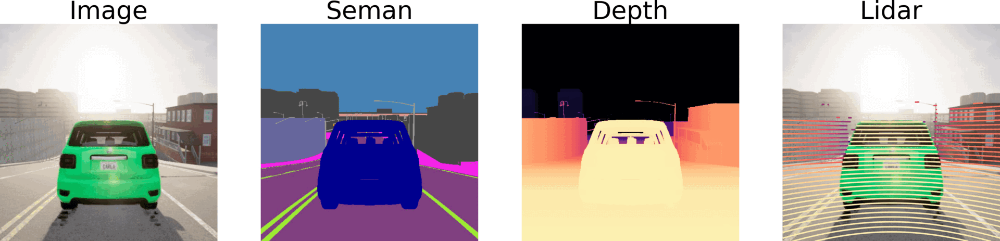

# CARLA Dataset




This repository extracts CARLA datasets at different camera intrinsics and extrinsics. The scraping code is based on the [Viewpoint Robustness, ICCV23](https://nvlabs.github.io/viewpoint-robustness/assets/tzofi2023view.pdf). The intrinsics are from the nuScenes dataset and loaded from the included JSON files `nusscalib.json` and `nuscncars.json`.  

Copyright © 2023, NVIDIA Corporation. All rights reserved.

Copyright © 2024, Michigan State University. All rights reserved.

## Citation

If you find our work useful in your research, please consider starring the repo and citing both these works:

```bibtex
@inproceedings{kumar2025charm3r,
    title = {{CHARM3R}: Towards Unseen Camera Height Robust Monocular 3D Detector},
    author = {Kumar, Abhinav and Guo, Yuliang and Zhang, Zhihao and Huang, Xinyu and Ren, Liu and Liu, Xiaoming},
    booktitle = {ICCV},
    year = {2025}
}
```

```bibtex
@inproceedings{tzofi2023view,
    title = {Towards Viewpoint Robustness in Bird's Eye View Segmentation},
    author = {Klinghoffer, Tzofi and Philion, Jonah and Chen, Wenzheng and Litany, Or and Gojcic, Zan
        and Joo, Jungseock and Raskar, Ramesh and Fidler, Sanja and Alvarez, Jose},
    booktitle = {ICCV},
    year = {2023}
}
```

## Prerequisites

Make a conda environment first:

```bash
conda create -n carla python=3.8 -y
conda activate carla
```

Download CARLA from the [CARLA download page](https://github.com/carla-simulator/carla/blob/master/Docs/download.md). Click on [CARLA 0.9.14](https://github.com/carla-simulator/carla/releases/tag/0.9.14/)
to download. Then, extract the file:

```bash
mkdir /home/abhinav/project/CARLA_0.9.14
tar -xzvf CARLA_0.9.14.tar.gz -C /home/abhinav/project/CARLA_0.9.14
cd /home/abhinav/project/CARLA_0.9.14
./ImportAssets.sh
```

Then, install the CARLA client and other dependencies:
```bash
pip install carla==0.9.14 nuscenes-devkit pygame networkx
```

Please note that we used `CARLA 0.9.14`, but the code is also compatible with later versions of CARLA. You will need to update the CARLAPATH in [src/sim_nuscenes.py](https://github.com/abhi1kumar/CARLA_rendering/blob/2c825c9d1a1ffe40223b595a30779f3cd69461db/src/sim_nuscenes.py#L17) to point to the correct `.egg` files, dependent on your version and the location where CARLA was downloaded.

## Rendering

Export the `CARLAPATH` first:

```bash
export CARLAPATH="/home/abhinav/project/CARLA_0.9.14"
```

#### Render All Configurations with Height Variations

Type the following command to render all height variations: 

```bash
bash run_all_height.sh
```

#### Render All Configurations with Height, Yaw, Pitch Variations

Type the following python command to render all height, yaw and pitch variations (please update the shell command in the script, as it currently uses NVIDIA NGC):

```bash
python run_all.py
```

#### Render One Configuration

Run the following bash script to render a train and test set (please update paths in bash script):

```bash
bash run_new.sh -4_6 pitch_height 0 -4 0.1524 # change description, type of change, yaw, pitch, height
```

Type of change and change description are concatenated to create the save folder, e.g. `pitch\_height-4\_6` indicates images within the folder have modified pitch (`-4` degrees) and modified height (`6` inches).

#### Render One Configuration with Python

Type the following python command to render (please note the first line starts the CARLA server and should be modified based on your CARLA server path):

```bash
/home/carla/CarlaUE4.sh --world-port=2040
python main.py scrape --outf=SAVEPATH --headless=True --rnd_seed=42 --filter_occluded=True --cam_yaw_adjust=YAW --cam_pitch_adjust=PITCH --cam_height_adjust=HEIGHT --port=2040 --map_name=MAPNAME
```

- `SAVEPATH`: specifies directory where data will be saved (a new subdirectory will be created via the code)
- `YAW`: change in yaw (in degrees)
- `PITCH`: change in pitch (in degrees)
- `HEIGHT`: change in height (in meters)
- `MAPNAME`: We use `Town03` for training and `Town05` for testing datasets

## CARLA to KITTI Converter

Converts the CARLA dataset (with depth and semantics) to KITTI style detection labels, which can then be used by any KITTI-style detector.

### Data

Arrange data as follows:

```
├── data
│      └── carla
│             └── carla_abhinav
│                    ├── pitch0
│                    │      ├── town03
│                    │      └── town05
│                    ├── height6
│                    │      ├── town03
│                    │      └── town05
│                    ├── height-6
│                    │      ├── town03
│                    │      └── town05
│                    ├── ...
│                    └── height30
│                           ├── town03
│                           └── town05
```

### Run

```bash
export CARLAPATH="/home/abhinav/project/CARLA_0.9.14"
python converter.py
```

The script will create new folders `calib` and `label` inside the individual 2500 folders of each town.


## Coordinate System

This repository uses the following coordinate systems:

Coordinate System | Name | Handed | X | Y | Z | Center
-- | -- | -- | -- | -- | -- | -- 
Rendering / Carla 3D Boxes | Unreal | Left | Inside | Right | Up | Ego car center 
Extrinsics Calc. | KITTI Image | Right | Right | Down | Inside | Ego car center
Images / KITTI 3D Boxes | KITTI Image | Right | Right | Down | Inside | Ego camera top-left corner


## Acknowledgements
We thank the authors of following awesome codebases:

- [Viewpoint Robustness](https://github.com/NVlabs/viewpoint-robustness)
- [DEVIANT](https://github.com/abhi1kumar/DEVIANT)

Please also consider citing them.

## Contributions
We welcome contributions to this repo. Feel free to raise a pull request.

## Contact
For questions, feel free to post here or drop an email to this address- ```abhinav3663@gmail.com```
