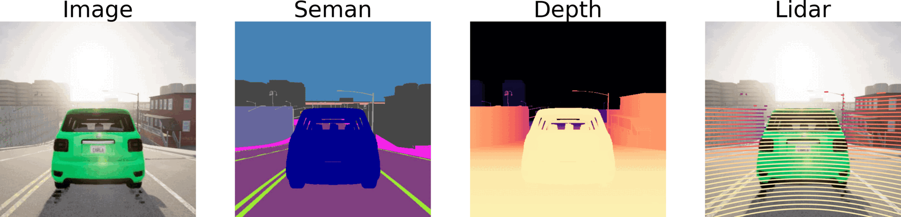

# CARLA Rendering



This repository extracts CARLA datasets at different extrinsics. The intrinsics are from the nuScenes dataset and loaded from the included JSON files `nusscalib.json` and `info.json`.  This repository uses the following coordinate systems:

Coordinate System | Name | Handed | X | Y | Z | Center
-- | -- | -- | -- | -- | -- | -- 
Rendering / Carla 3D Boxes | Unreal | Left | Inside | Right | Up | Ego car center 
Extrinsics Calc. | KITTI Image | Right | Right | Down | Inside | Ego car center
Images / KITTI 3D Boxes | KITTI Image | Right | Right | Down | Inside | Ego camera top-left corner


## Prerequisites

Download CARLA (either in Docker or directly on your server). If using Docker, please refer to the included Dockerfile.

```bash
conda create -n carla python=3.8 -y
conda activate carla
pip install --user pygame numpy && pip3 install --user pygame numpy
```

Go to [CARLA download page](https://github.com/carla-simulator/carla/blob/master/Docs/download.md). Click on [CARLA 0.9.14](https://github.com/carla-simulator/carla/releases/tag/0.9.14/)
to download. Then, extract the file

```bash
mkdir /home/abhinav/project/CARLA_0.9.14
tar -xzvf CARLA_0.9.14.tar.gz -C /home/abhinav/project/CARLA_0.9.14
cd /home/abhinav/project/CARLA_0.9.14
./ImportAssets.sh
```

Then, install the CARLA client:
```bash
pip install carla==0.9.14
```

Finally install other dependencies:

```bash
pip install nuscenes-devkit pygame networkx
```

Please note that we used CARLA 0.9.8, but the code is also compatible with later versions of CARLA. You will need to update the CARLAPATH in src/sim\_nuscenes.py to point to the correct .egg files, dependent on your version and the location where CARLA was downloaded.

## Rendering

```bash
export CARLAPATH="/home/abhinav/project/CARLA_0.9.14"
```

### Bash Command for Rendering One Configuration

Bash script to render a train and test set (please note paths in bash script will need to be updated):

```bash
bash run_new.sh -4_6 pitch_height 0 -4 0.1524 # change description, type of change, yaw, pitch, height
```

Type of change and change description are concatenated to create the save folder, e.g. pitch\_height-4\_6 indicates images within the folder have modified pitch (-4 degrees) and modified height (6 inches).

### Bash Command for Rendering All Datasets

Python command to render ALL train and test sets (please note that the shell command used in the script will need to be updated, as it currently uses NVIDIA NGC):

```bash
python run_all.py
```

### Python Command

Python command to render (please note the first line is for starting the CARLA server and should be modified based on your CARLA server path):

```bash
/home/carla/CarlaUE4.sh --world-port=2040
python main.py scrape --outf=SAVEPATH --headless=True --rnd_seed=42 --filter_occluded=True --cam_yaw_adjust=YAW --cam_pitch_adjust=PITCH --cam_height_adjust=HEIGHT --port=2040 --map_name=MAPNAME
```

- SAVEPATH: specifies directory where data will be saved (a new subdirectory will be created via the code)
- YAW: change in yaw (in degrees)
- PITCH: change in pitch (in degrees)
- HEIGHT: change in height (in meters)
- MAPNAME: We use Town03 for training and Town05 for testing datasets

## CARLA to KITTI Converter

Converts the CARLA dataset (with depth and semantics) to KITTI style detection labels.

### Environment

```bash
conda create -n carla python=3.8 -y
conda activate carla
pip install nuscenes-devkit pygame networkx matplotlib
```

### Data

Arrange data as follows:

```
├── data
│      └── carla
│             └── carla_abhinav
│                    ├── pitch0
│                    │      ├── town03
│                    │      └── town05
│                    ├── height6
│                    │      ├── town03
│                    │      └── town05
│                    ├── height-6
│                    │      ├── town03
│                    │      └── town05
│                    ├── ...
│                    └── height30
│                           ├── town03
│                           └── town05
```

### Run

```bash
export CARLAPATH="/home/abhinav/project/CARLA_0.9.14"
python converter.py
```

The script will create new folders `calib` and `label` inside the individual 2500 folders of each town.


## License and Citation

The scraping code is based on the ICCV23 work. Please consider starring the repo and citing

```bibtex
@inproceedings{tzofi2023view,
    title = {Towards Viewpoint Robustness in Bird's Eye View Segmentation},
    author = {Klinghoffer, Tzofi and Philion, Jonah and Chen, Wenzheng and Litany, Or and Gojcic, Zan
        and Joo, Jungseock and Raskar, Ramesh and Fidler, Sanja and Alvarez, Jose},
    booktitle = {ICCV},
    year = {2023}
}
```

```bibtex
@inproceedings{kumar2024extrinsics,
    title = {Viewpoint Robustness for Monocular 3D Object Detection},
    author = {Kumar, Abhinav and Guo, Yuliang and Liu, Xiaoming},
    booktitle = {in submission},
    year = {2024}
}
```

Copyright © 2023, NVIDIA Corporation. All rights reserved.

Copyright © 2024, Michigan State University. All rights reserved.

## Contact
For questions, feel free to post here or drop an email to this address- ```abhinav3663@gmail.com```
